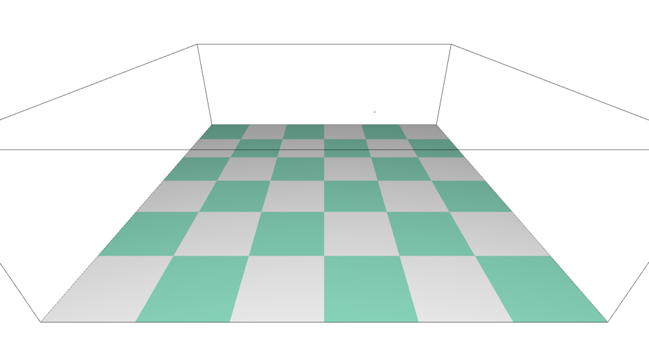
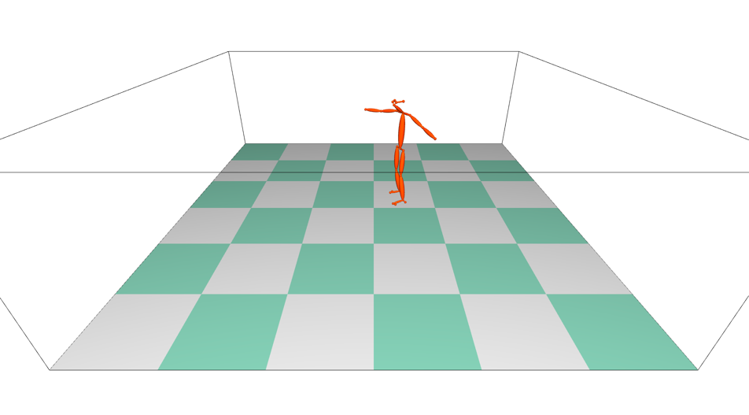
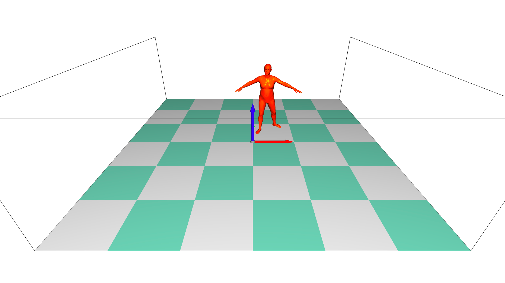
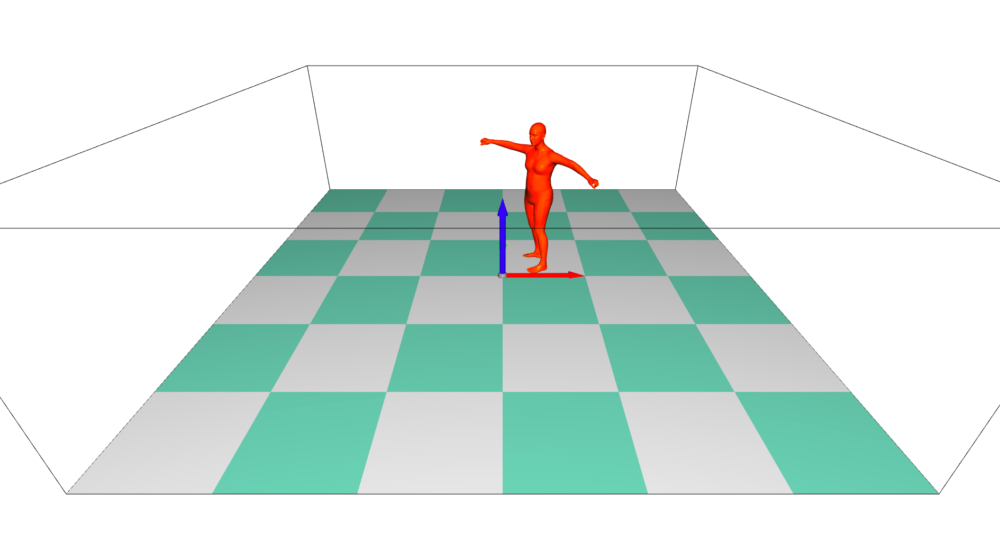

# 3D human model Visualization Module
extract the source code from [EasyMocap](https://github.com/zju3dv/EasyMocap/blob/master/doc/realtime_visualization.md)

| TYPE | IMAGE |
|------|-------|
|SCENE||
|BODY||
|SMPL||
|SMPLX||
## ENV
- open3d==0.9.0
- torch (for smpl-like model.)
## USAGE 
**should put the `data/` into `${vis/lib}`.**
```buildoutcfg
cd ${vis}/main
python vis_server.py # first config the .yml file.
python vis_client.py --path ${to/you/data} [--smpl]
```
